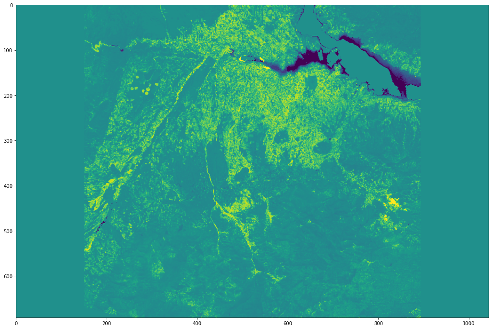
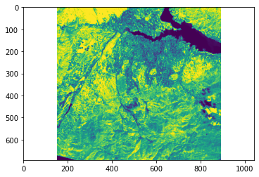
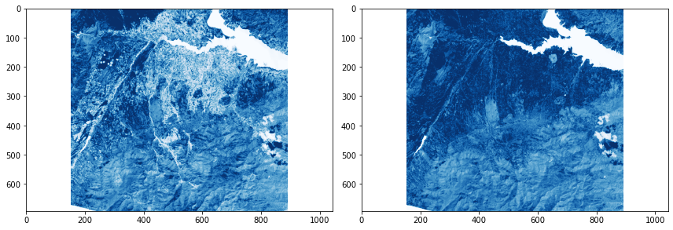
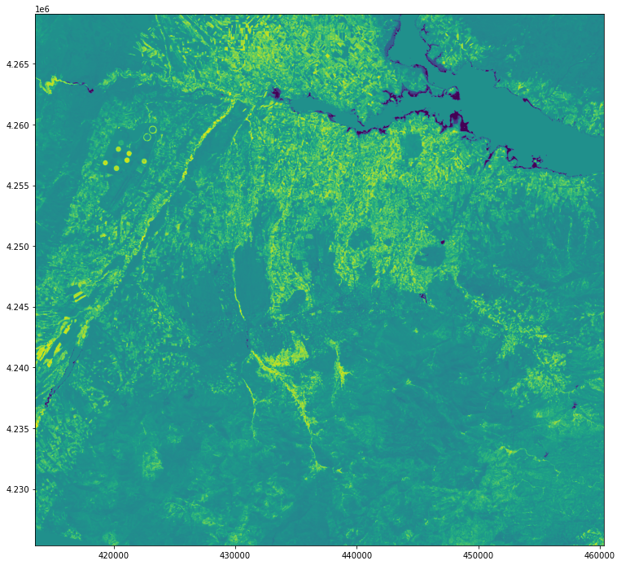
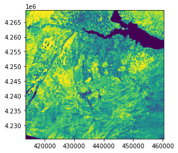
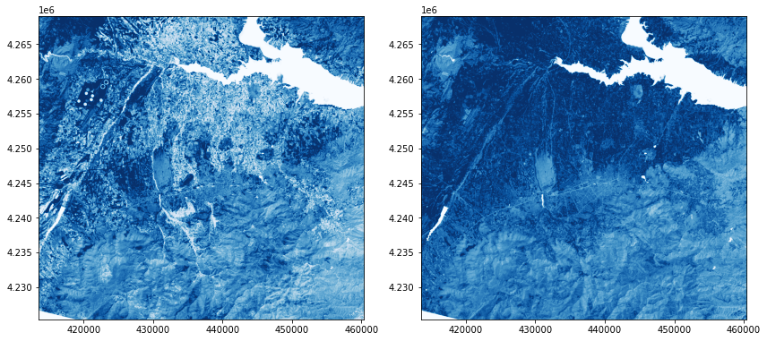

# GEO468_RS_Spec_Top_Personal-HW_010160623_Yasin-Memi
## Aim of the Project
To examine the change of vegetation cover in Malatya-Karakaya Dam (Türkiye) region between 2016-2020.

## NDVI Application using Jupyter Notebook
Images obtained from USGS EarthExplorer. Images of 2016 and 2020 were used. NDVI was applied using the codes to detect the vegetation in these images.

### What is NDVI?
The Normalized Vegetation Index (NDVI) measures vegetation by measuring the difference between near infrared (reflects strongly by vegetation) and red light (absorbed by vegetation).
It uses NIR and red channels in the Normalized Vegetation Index (NDVI) formula as shown below.
- NDVI = (NIR - Red) / (NIR + Red)

### Jupyter Notebook's Libraries and DataSet Collection
- rasterio
- matplotlib
- numpy libraries used.

The satellite name, date information and metadata links of the images used in the project are shared below.

- Landsat-8 (2020-08-01): https://earthexplorer.usgs.gov/scene/metadata/full/5e83d14f2fc39685/LC81730342020214LGN00/
- Landsat-8 (2016-08-22): https://earthexplorer.usgs.gov/scene/metadata/full/5e83d14f2fc39685/LC81730332016235LGN01/

Band-4 (Red) and Band-5 (NIR) images of the images belonging to the above information were used in NDVI calculation.

## NDVI
Using the codes, NDVI calculations were made with Red and NIR bands. It is aimed to analyze the images by using different coloring. The images obtained as a result of the processes are shown below.

NDVI, NDVI-Vegetation and NDVI-Non-Vegetation images of 2016

 
 

NDVI, NDVI-Vegetation and NDVI-Non-Vegetation images of 2020

 
 

When the images were examined, it was observed that the vegetation cover slightly increased over time in areas known to be close to the water source.

## REFERENCES
- https://gisgeography.com/ndvi-normalized-difference-vegetation-index/
